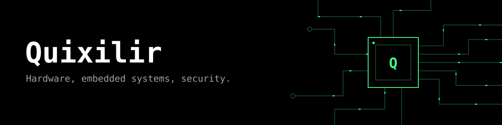

Electronics hobbyist working where hardware meets security. I build embedded devices, test gear and firmware tools, mostly around the ESP32.

## Links

- Website: [quixilir.pages.dev](https://quixilir.pages.dev)
- Devices: [Tindie store](https://www.tindie.com/stores/Quixilir)
- Video: [YouTube](https://www.youtube.com/@quixilir) and [TikTok](https://www.tiktok.com/@quixilir)
- Used gear: [Vinted](https://www.vinted.ro/member/252497020-quixilir)

## What I build

- Standalone handheld PCB running Bruce firmware, an ESP32-based pentest multi-tool
- Assembled Bruce devices, sold on Tindie
- Test equipment: capacitance meters, an ESP8266 battery capacity tester
- Radio: HackRF with Portapack, a wooden AM frame loop antenna for medium-wave DX
- Raspberry Pi Zero 2W cyberdeck
- Smart aeroponic tower with an ESP32

## Hardware

ESP32, ESP8266, Arduino, Raspberry Pi Zero 2W, HackRF

## Contact

Message me through the [website](https://quixilir.pages.dev), or on Discord: whitewolf04898
